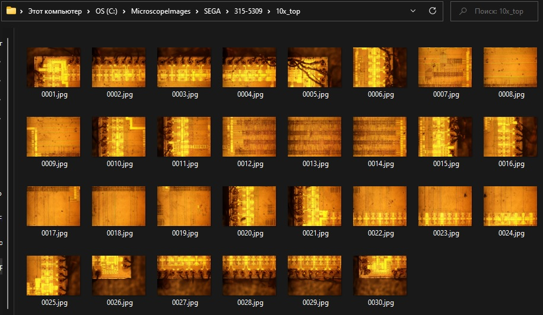
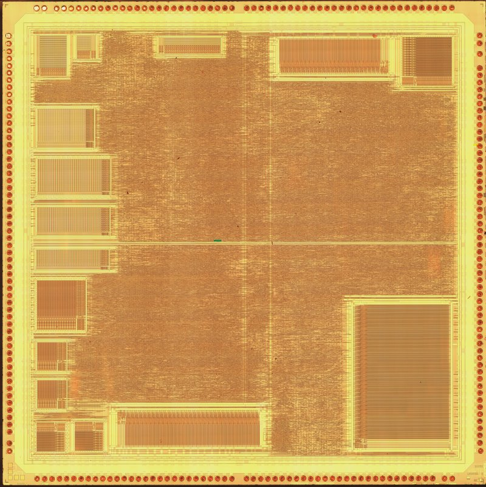
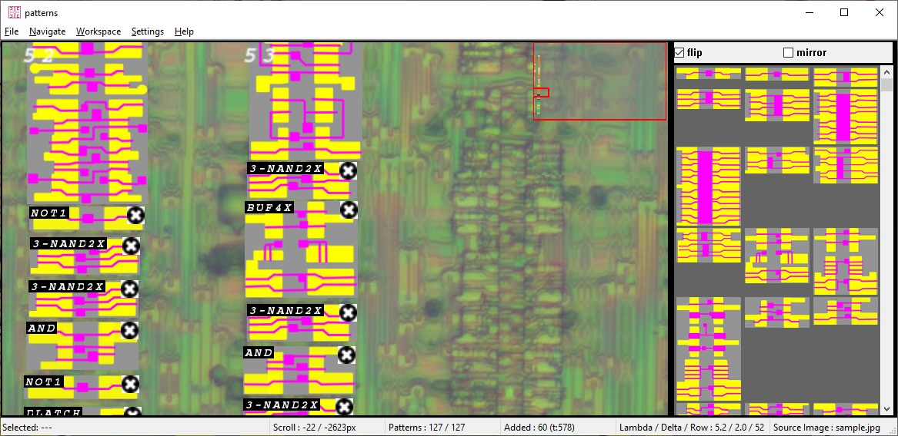
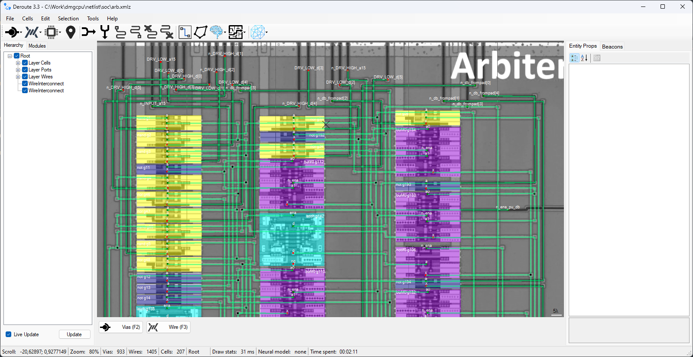
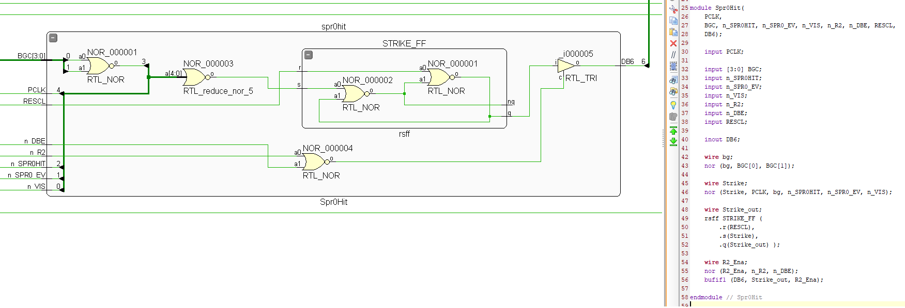
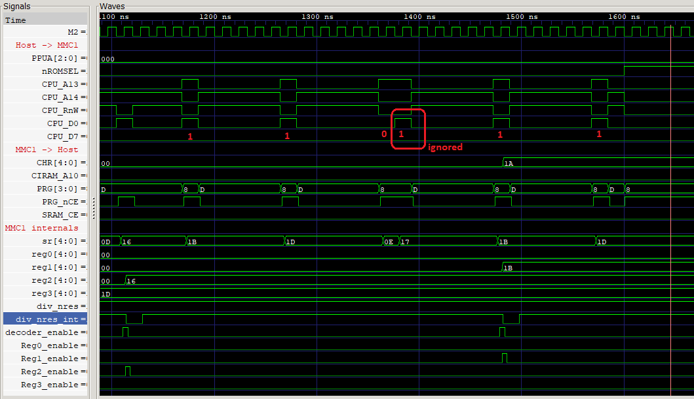
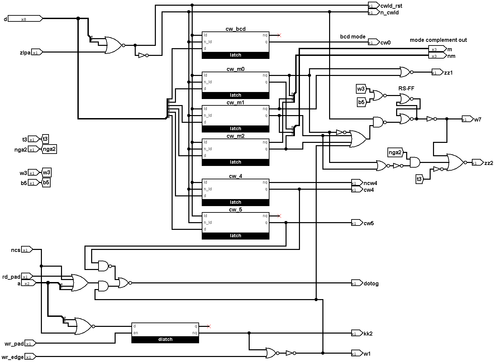

# From die to schematic

A practical workflow for investigating a new integrated circuit. Eight stages, each with an action, a saved result, and a condition for moving forward.

[Русский](workflow.ru.md) · [Sources and history](sources.en.md)

<a id="overview"></a>

## How to use this guide

Start with one small block whose inputs can be driven and whose outputs can be checked. Complete the entire loop through a working check, then expand the investigation. Different blocks of a large chip may be at different stages at the same time.

**Route:** project record → images → map → elements → connections → model → verification → publication. When a check disagrees with an observation, return to the first unproven connection, element, or timing assumption.

This is an independent synthesis of material from nine emu-russia projects. Project practices are linked to sources; the record templates, order of checks, and completion criteria below are recommendations of this guide. They do not imply that every source project has completed the entire route. The [source review](sources.en.md#scope) defines the snapshot and the limits of the investigation.

### Choose the depth of investigation

| Goal | Required result | What that result does not establish |
| --- | --- | --- |
| Understand one circuit | Image crop, schematic, signal meanings, checked scenario | Correct operation of other blocks |
| Recover the structure | Transistors or cells and all connections in the selected area | Correct timing and analogue behaviour of the model |
| Build a research model | Circuit behaviour under explicitly recorded assumptions | FPGA suitability or silicon accuracy in every operating mode |
| Produce a synthesizable implementation | A separate adaptation checked against the research model | Automatic preservation of the original topology |

[breaks][B1] chooses a die-perfect approach: HDL follows the original circuit closely; synthesizability is not a goal. [SEGAChips/Z80][S3] uses a hybrid approach: inter-block buses are annotated manually and cell domains are recovered in Deroute. Select tools according to the structure of the block.

### Start today

1. Record the exact marking and one question, such as which edge accepts a write.
2. Find an image of the required revision and choose a readable area with an input and an output.
3. Create a block record using [stage 8](#stage-08); leave unknown fields unknown.
4. Recover a short path through one element and prepare one test that distinguishes the competing explanations.

<a id="stage-01"></a>

## 01. Define the device and question

A single project record links the package, die, images, and eventual model.

**Input:** a chip specimen or an available dataset, and a research question.

1. Photograph package markings, pin-one orientation, board designation, and die markings when available. Record the specimen's source and the board revision. Do not substitute the most common revision for an unknown one.
2. Collect the datasheet, pinout, application schematic, and earlier investigations. Record the revision and origin of each document. Pin compatibility does not establish identical internal wiring.
3. Choose the boundary: whole chip, core, channel, interface, or cell. Describe observable inputs and outputs and what would count as an answer.
4. Make a coverage table: block → available images → known schematics → unclear areas → next experiment. Begin with a readable circuit whose function can be checked.

**Why this matters.** In mappers, the investigated device was initially labelled MMC1A and later corrected to letterless MMC1. [PSXCPU][P4] studies revision 90048 specifically; the author warns that other revisions may require the wiring to be recovered again. The MMC1 correction is linked in the [source history](sources.en.md#source-mappers).

**Save:** the project record, source list, block boundary, and verification criterion.

**Proceed when:** the selected images belong to the established revision, or the mismatch is explicitly recorded, and the question can be turned into an observation. Resolve unknown image provenance first.

<a id="stage-02"></a>

## 02. Acquire and prepare images

Preserve source data before processing it and before any irreversible change to the specimen.

**Input:** the project record, existing photographs, or a plan for acquiring missing images.

Use an existing dataset first if it answers the question. Decapsulation and layer removal are needed only where the required connection cannot otherwise be seen. These are destructive laboratory operations: use a trained operator, suitable equipment, and an approved safety procedure. Older descriptions of home methods in the sources are not validated safety instructions; their chemical and medical claims are not reproduced here.

1. Separate raw frames, stitched images, and working annotations. Record specimen, layer or preparation session, objective, orientation, frame order, and scale. Names such as `lap1` and `lap2` identify sessions, not necessarily distinct physical layers.
2. Capture a regular grid with enough overlap for reliable stitching. Calibrate overlap on a small trial area; check focus and contact visibility. Do not transfer settings from another imaging session without checking them.
3. Stitch the mosaic. [dmgcpu's methods][D1] use Fiji, Grid/Collection stitching, with grid order, dimensions, overlap, and filename pattern specified. The author suggests Hugin when stitching is troublesome. Keep parameters and raw frames so the mosaic can be rebuilt.
4. Check seams using continuous wires and several landmarks across the image. A doubled wire, missing contact, or displaced row means returning to the source frames.
5. Align images from different depths. Keep patches from other sessions on separate layers and identify their sources. Do not paint an assumption into a missing photograph.



*Source frames from dmgcpu. Overlap supports a shared coordinate system; stitching alone does not establish electrical connectivity. [Image provenance](sources.en.md#images).*

**Save:** unmodified frames, mosaics, stitching parameters, preparation log, and a map of unreadable areas.

**Proceed when:** the required elements and contacts are visible in the selected block and alignment has been checked throughout it. [PSXCPU's datasets][P1] have a separate Missing M1 section: part of the layer was lost during lapping. This is a reason to check image coverage before the next preparation step.

<a id="stage-03"></a>

## 03. Map the die

Identify layers, external connections, and major regions before interpreting every gate.

**Input:** a checked mosaic and package information.

1. Fix a master dataset: the working image to which coordinates refer. Describe its origin, orientation, units, and transformations for other images.
2. Define a legend for layers and symbols. Distinguish metal, polysilicon, diffusion, contacts, and crossings without contacts. Annotation colours are an author's convention, not a physical property.
3. Walk around the pads: package pin → pad → signal name → direction → active level. Trace power, ground, reset, and clock paths. Cross-check several reference pins against the board schematic.
4. Mark memory arrays, repeating rows, decoders, buses, and custom blocks. Label tentative functions as hypotheses. A physical rectangle need not correspond to a logical module.
5. Select a small block and list every net crossing its boundary, including clocks, supplies, and control inputs.



*PSXCPU: regular arrays around the edges help with orientation but do not establish a block's function on their own. The M2 image is published in the [datasets][P1].*

**Account for the technology.** [breaks][B2] describes NMOS chips with one metal layer; the [SEGA arbiter][S2] has a particular two-metal interconnect and cell arrangement; [ULA][U2] uses bipolar transistors. Recognition rules from one process do not automatically apply to another. In the VI53, even functionally identical channels have different layouts ([PDF, pp. 5–7][V1]).

**Save:** a block map, legend, pad table, and the first block's interface.

**Proceed when:** every external connection of the selected area is accounted for and unknowns are marked. If a signal leaves the boundary without a known continuation, expand the area or create an explicit unresolved port.

<a id="stage-04"></a>

## 04. Recover the elements

Choose manual transistor reconstruction or a library of repeating cells; combine them within a chip when its structure calls for it.

**Input:** the block map and readable images of the necessary layers.

### The transistor route

For irregular logic, first recover conducting regions, gates, and contacts; then transistor connections; then the logical function. Check transistor types against the process and surrounding circuit. Two crossing lines in a photograph do not, by themselves, establish either a transistor or an electrical contact.

Mark load transistors, dynamic nodes, precharge, and bidirectional paths separately. [VI53, p. 10][V1] shows the transition from coloured masks to a transistor schematic, including a symbol for a crossing without a connection. Comparison with Intel 8253 helped clarify diffusion, but the author found differences between the chips: an analogue is useful for testing a hypothesis, not for copying blindly.

### The standard-cell route

1. Find a clear specimen of each new type. Recover its transistors, ports, function, and orientation. For a sequential cell, record its edge or transparent phase, reset, and output polarities.
2. Add an image, stable name, dimensions, and scale to the library. Do not merge similar-looking variants before checking their ports and functions: [PSXCPU][P2] explicitly warns about similar NOT2 and NAND2X cells.
3. In [Patterns][T1], load a JPEG and `patterns_db.txt`, set Lambda for scale and Delta for matching tolerance. Select an area and choose a candidate. Check flip/mirror and port order against the actual photograph.
4. Save the `.wrk`, the library version used, and the placed-element export. This speeds up identification of types and coordinates; wiring remains a separate task.



*Instances on the left, library on the right. Template selection requires orientation and contact checks. Source: [Patterns][T1].*

**Save:** the library with port tables, placed instances, unknown-cell list, and a function check for each type used.

**Proceed when:** every element of the selected block is identified or marked unknown with explicit ports. Renaming a library requires migration of old workspaces: [ArbPatterns][S4] warns about this incompatibility.

<a id="stage-05"></a>

## 05. Recover the connections

The netlist must retain a traceable relationship between each wire in the image and its representation in the model.

**Input:** the master dataset, elements, port library, and block interface.

[dmgcpu][D3] gives an explicit sequence: image → external ports → cell placement → interconnects → Verilog export.

1. Load the image in Deroute, set Lambda, and check coordinate alignment at several distant landmarks. Save a small scene first and verify that it opens correctly again.
2. Mark external `ViasInput`, `ViasOutput`, and `ViasInout`; place cells and their named ports. Assign unambiguous instance and net identifiers. A name such as `nRESET` is only useful alongside a polarity table.
3. Trace each net between actual contacts. A wire on another layer does not connect without the relevant transition. Semi-automatic joining of outermost vias, as described for [PSXCPU][P3], requires bends and intermediate contacts to be handled separately.
4. Check a net with Traverse, from its source to its consumers and back. Inspect supply connections, open ends, crossings, and damaged-image areas. Accidentally selecting a neighbouring net means returning to the geometry.
5. Save XML/XMLZ and run Export to Verilog. Menu placement varies by version; the [MMC1 demo][R1] gives a complete scene-loading and export path. Read diagnostic comments in the resulting file.



*A single-block example: external ports and library cells connected over the master dataset. Source: [dmgcpu/netlist][D3].*

The [Deroute exporter][R2] reports unnamed cell ports, unconnected ports, some driver conflicts, and floating nets. These checks depend on annotated port types and do not establish agreement with silicon. An intentional tristate bus needs checking across driver-enable modes; do not delete an extra output merely to silence a message.

**Save:** the editable scene, library, export, and a record of resolved or explained warnings.

**Proceed when:** all block ports map to the image, every unknown connection is listed, and the export compiles with cell definitions. Do not make generated Verilog the only source of truth: correct the scene or library and export again.

<a id="stage-06"></a>

## 06. Build an executable model

Preserve the structure first, then raise the abstraction level while checking each substitution.

**Input:** the netlist, element functions, and a list of assumptions.

1. Connect primitive models and a small testbench. Explicitly drive external inputs, supply constants where appropriate, clocks, startup procedure, and a simulation time limit.
2. Check primitives: truth tables for combinational cells; capture and hold for latches; edge, reset, and priorities for flip-flops. Do not replace a transparent latch with an edge-triggered flip-flop for convenience.
3. Describe `X`, `Z`, initial states, precharge, bus retention, and driver strengths separately when relevant. Starting a model with forced zeros is a startup assumption that must accompany the result.
4. Generate a schematic from HDL and check the interface, feedback, and inversions. Keep flat exports separate from the reorganized model. Retain a mapping from old nets to new names.
5. State the digital model's boundary for analogue outputs, dynamic storage, or delays that affect function. Questions about voltage or physical pulse width require measurements or a suitable electrical model with justified parameters.



*breaks: the schematic and HDL preserve the original circuit's structure. This research choice is described in [HDL/Readme][B3].*

[ULA][U3] illustrates the next level: a large netlist is split into modules and some feedback structures are replaced with storage primitives. [VCounter][U4] exposes exceptions: different bits use different clocks, resets, and shared gates. Partitioning into supposedly identical bits must be justified by connections.

**Save:** the source netlist, reorganized model, cell models, name mapping, testbench, and simulation assumptions.

**Proceed when:** simulation time advances, observed outputs change as expected, and unexplained `X/Z` values have been investigated. Compilation or a neatly rendered schematic is not a behavioural check.

<a id="stage-07"></a>

## 07. Verify and refine

A check should distinguish competing explanations and lead to a specific part of the circuit.

**Input:** an executable model, an expected observation, and an independent comparison source when available.

| Level | Minimum check | Record |
| --- | --- | --- |
| Cell | All combinations of a small cell; capture/hold for storage | Inputs, expected output, phase |
| Block | Reset, ordinary operation, boundary event | Stimulus, probes, first error |
| Interface | Reads, writes, adjacent cycles, driver enables | Clocks, address, data, control signals |
| System | Test program or complete peripheral cycle | Reference state and time limit |
| Correspondence | Another representation or physical measurement | Signal names, polarities, time alignment, differences |

Define a checkable expectation and timeout for every test. Save the command, tool version, model, stimulus, result, and VCD/FST with the observed signal set. A waveform image helps interpretation; numerical comparison or an assertion enables repetition.



*The [MMC1 testbench][M2] highlights ignored-second-write behaviour. A boundary case like this distinguishes protocol verification from an ordinary-write demonstration. This is a source illustration, not a new run performed for this guide.*

### Find the first divergence

1. Reproduce the error with the smallest stimulus. Check that the expected value belongs to the same revision and sampling instant.
2. Match names and active levels. [Breaks ↔ Visual 2C02][B5] provides an example of a separate signal mapping table.
3. Work backwards from the wrong output: driver → logic → state → clock phase → physical contact.
4. Correct the earliest mistaken assumption. Repeat the failing check and affected scenarios. If cell identification changed, recheck its instances.

**SM83 example.** In the [investigation notes][D4], conditional RET instructions initially appeared to have a polarity problem. Comparing models exposed a timing problem; the eventual explanation was an omitted transparent latch present in the original circuit. Adding an arbitrary delay was rejected. Do not promote a crossed-out intermediate hypothesis into the final method.

**Limits of the evidence.** In [VI53, p. 15][V1], `wr_edge.v` checks pulse polarity using illustrative delays; it does not measure silicon timing. [SM83][D5] CPU tests use `Bogus_HW` for their environment: passing them does not validate the entire SoC. Agreement between two models derived from the same incorrect netlist also does not replace checking images or hardware.

**Save:** reproducible tests, results, first divergence, and the correction tied to the schematic.

**Proceed when:** the criterion in the project record is met, limits are stated, and another researcher can repeat the check. If it is not met, publish a partial investigation with a concrete unresolved question.

<a id="stage-08"></a>

## 08. Preserve and hand over the result

An investigation is complete within its selected boundary when the evidence can be followed, not merely when the final image opens.

**Input:** images, schematic, model, and verification of one block.

Assemble a compact chain: die crop → annotated elements → net → HDL → test → conclusion. Identify compatible versions of images, exports, and models. [breaks][B1] notes that books may differ from the Wiki, and its [HDL documentation][B3] warns that exported schematics may lag behind: version publications together.

### New-block record

Copy this template into the research repository and fill it in as work proceeds.

```text
Block / question:
Chip, markings, revision:
Block boundary and checkable criterion:
Image source, permission to reuse:
Master dataset, scale, orientation, coordinates:
Required layers and missing areas:
Ports: name, direction, active level, source:
Cell library and version:
Scene / netlist / model:
Assumptions: startup, X/Z, delays, analogue effects:
Check command, tool version, stimulus:
Expected / observed / first difference:
Confirmed:
Hypotheses and how to distinguish them:
Next step:
```

### A sufficient handover

- Raw data or stable links, provenance, permissions, and checksums.
- Editable masks, scenes, and libraries alongside exports.
- Port and name tables, explicit block connections, and an unknowns list.
- Model, testbench, commands, results, and the scope of verified behaviour.
- Concise Russian and English text with matching qualifications, figure captions, and references.

For a large dataset, separate storage with a manifest is sufficient; do not put gigabyte archives into ordinary Git by habit. Directory names are flexible, but raw sources, annotations, and derived files must be distinguishable.

**Handover check:** open the package in a clean directory, check image and library paths, repeat the export and one key test. List verified blocks and remaining questions in the final status instead of one vague “done”.



*The control-word schematic from SovietChips is a readable block representation accompanying a research PDF and Logisim project. Having a schematic does not mean the whole timer has been behaviourally verified. [VI53 review](sources.en.md#source-sovietchips).*

<a id="glossary"></a>

## Short glossary

| Term | Meaning in this guide |
| --- | --- |
| Die | The semiconductor piece inside an IC package |
| Master dataset | The selected image to which working annotations refer |
| Topology | The geometry of layers and elements on the die |
| Via / contact | A connection between conducting layers; the precise type depends on the process |
| Net | An electrically connected group of contacts and wires |
| Netlist | Elements, their ports, and the nets connecting them |
| Cell | A reusable circuit type; an instance is a particular occurrence |
| Lambda | The coordinate scale in the tools used here, not a universal value in nanometres |
| Latch | Storage that is transparent during an enabled phase |
| Precharge | Establishing charge before evaluation or reading |
| X / Z | Unknown value / high-impedance state in a digital model |
| HDL | Hardware description language; mainly Verilog in these projects |
| Testbench | An environment that drives stimuli and observes or checks a model |

Continue with [the nine projects, their contributions, history, and image provenance](sources.en.md).

[B1]: https://github.com/emu-russia/breaks/blob/a378efe01259735813a6edd3dd6090e27ee0ee32/README.md
[B2]: https://github.com/emu-russia/breaks/blob/a378efe01259735813a6edd3dd6090e27ee0ee32/BreakingNESWiki/Readme.md
[B3]: https://github.com/emu-russia/breaks/blob/a378efe01259735813a6edd3dd6090e27ee0ee32/HDL/Readme.md
[B5]: https://github.com/emu-russia/breaks/blob/a378efe01259735813a6edd3dd6090e27ee0ee32/BreakingNESWiki/PPU/visual2c02.md
[D1]: https://github.com/emu-russia/dmgcpu/blob/f0fbc8f293b1687d22cd157968a49cf6e3b13280/wiki/methods.md
[D3]: https://github.com/emu-russia/dmgcpu/blob/f0fbc8f293b1687d22cd157968a49cf6e3b13280/netlist/Readme.md
[D4]: https://github.com/emu-russia/dmgcpu/blob/f0fbc8f293b1687d22cd157968a49cf6e3b13280/wiki/sm83/investigation.md
[D5]: https://github.com/emu-russia/dmgcpu/blob/f0fbc8f293b1687d22cd157968a49cf6e3b13280/HDL/sm83/Icarus/Readme.md
[M2]: https://github.com/emu-russia/mappers/blob/d5bb7ac15363f63ff26762b000a1e76ac7aa9ae4/MMC1/icarus/Readme.md
[P1]: https://github.com/emu-russia/psxcpu/blob/df47207c9deed1e9e488c49b8b0c362813102863/datasets.md
[P2]: https://github.com/emu-russia/psxcpu/blob/df47207c9deed1e9e488c49b8b0c362813102863/cells.md
[P3]: https://github.com/emu-russia/psxcpu/blob/df47207c9deed1e9e488c49b8b0c362813102863/netlist/Readme.md
[P4]: https://github.com/emu-russia/psxcpu/blob/df47207c9deed1e9e488c49b8b0c362813102863/Readme.md
[R1]: https://github.com/emu-russia/Deroute/blob/86950a9466f6df8a60ac6c306f60cda4abdb07f0/Demo/ReadmeRus.md
[R2]: https://github.com/emu-russia/Deroute/blob/86950a9466f6df8a60ac6c306f60cda4abdb07f0/Deroute/GetVerilog.cs
[S2]: https://github.com/emu-russia/SEGAChips/blob/1b378b45c8f0a88501ba593cc480dc5159149a8d/Arbiter/topo.md
[S3]: https://github.com/emu-russia/SEGAChips/blob/1b378b45c8f0a88501ba593cc480dc5159149a8d/Z80/netlist/Readme.md
[S4]: https://github.com/emu-russia/SEGAChips/blob/1b378b45c8f0a88501ba593cc480dc5159149a8d/Arbiter/ArbPatterns/Readme.md
[T1]: https://github.com/emu-russia/Patterns/blob/6dd2badffa8d5422da66b78d20b7330df30ec5c4/UserManual/patterns_russian.md
[U2]: https://github.com/emu-russia/ula/blob/475d40245c478bda1a3a760b0e50be66f2f3f7ff/topo.md
[U3]: https://github.com/emu-russia/ula/blob/475d40245c478bda1a3a760b0e50be66f2f3f7ff/hdl/Readme.md
[U4]: https://github.com/emu-russia/ula/blob/475d40245c478bda1a3a760b0e50be66f2f3f7ff/vcounter.md
[V1]: https://github.com/emu-russia/SovietChips/blob/2b64738d83768f9edce4935c2581f0002a4c49fa/580%D0%92%D0%9853/580%D0%92%D0%9853_research_C3.pdf
