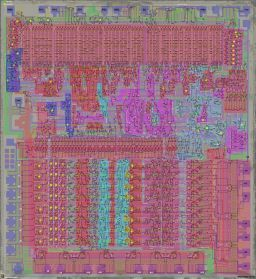
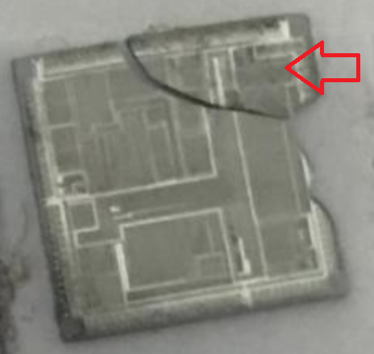
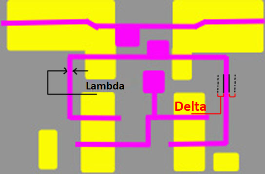
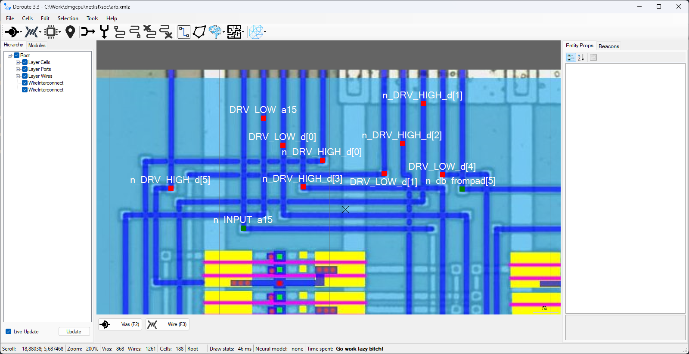
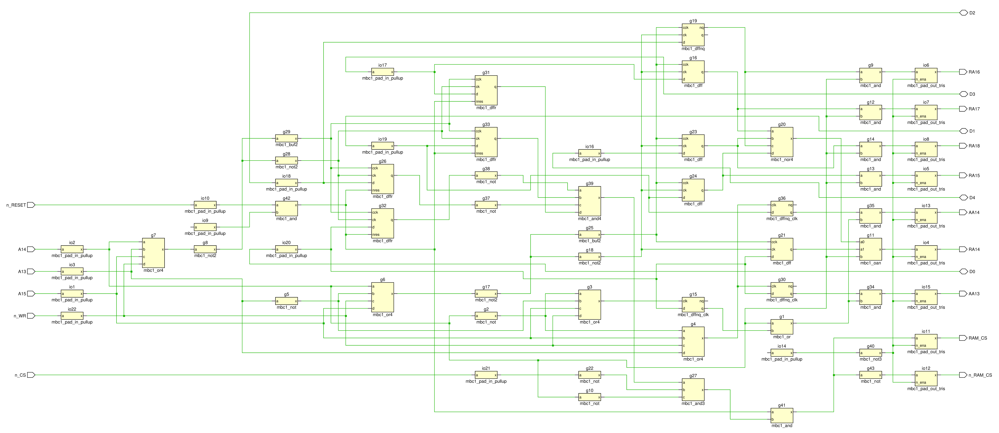

# От кристалла к проверяемой модели

Практическая методика исследования микросхем по материалам девяти проектов emu-russia.

[English](workflow.en.md) · [Маршрут](#route) · [Этапы](#dossier) · [Чек-лист](#checklist) · [Источники и история](#evidence)

Задача исследования — получить результат, который другой человек сможет проверить: найти элемент на снимке, проследить его соединения, запустить модель и понять границы её достоверности. Полная реконструкция чипа нужна не всегда. Для первого прохода выберите один небольшой блок с понятными входами и наблюдаемым выходом.

Это самостоятельное обобщение документации, артефактов и выбранных коммитов **breaks, SEGAChips, dmgcpu, Deroute, mappers, SovietChips, ula, psxcpu и Patterns**, просмотренных 5 сентября 2026 года. Предлагаемые критерии готовности — выводы автора методики; примеры из проектов снабжены ссылками. Мы не запускали их HDL и не проводили аппаратных экспериментов. Дата или название коммита подтверждает историю публикации, а не успешное выполнение теста сегодня.

<a id="route"></a>
## Маршрут: семь результатов вместо одного большого обещания

| Результат | Что должно остаться после работы |
| --- | --- |
| 01. Паспорт | Точный экземпляр и ревизия, вопрос исследования, границы блока, эталон |
| 02. Датасет | Исходные кадры, проверенный мастер, совмещение слоёв, карта дефектов |
| 03. Библиотека | Подтверждённые элементы с портами, функцией и правилами ориентации |
| 04. Нетлист | Разметка и структурные соединения, связанные с координатами на фото |
| 05. Модель | Библиотека примитивов, исполняемая схема, тестбенч и условия запуска |
| 06. Проверка | Ожидаемое и фактическое поведение, расхождения, границы покрытия |
| 07. Публикация | Воспроизводимый комплект с источниками, лицензиями и открытыми вопросами |

Основной путь: **паспорт → датасет → библиотека ↔ нетлист → модель ↔ проверка → публикация**. Документируйте решения с первого дня. Для ячеечного чипа разметка экземпляров и трассировка идут итерациями; для заказной топологии транзисторный разбор может предшествовать распознаванию логики. Не ждите окончания всего кристалла, чтобы проверить первый модуль.

Выбор точки входа:

- **Есть подходящие снимки:** проверьте их ревизию и качество и начните с датасета. Новое вскрытие не является обязательным этапом.
- **Есть нетлист или HDL:** проверьте происхождение и начните с небольшого теста; возвращайтесь к снимку при расхождениях.
- **Есть только микросхема:** сначала составьте паспорт и план получения изображений, включая допустимые потери образца.
- **Повторяющиеся ряды ячеек:** сначала исследуйте типы и их ориентацию. **Нерегулярная логика, память, аналоговые узлы:** выделите отдельные области и выберите для каждой нужную детализацию.

Всякий раз различайте четыре состояния: **видно на фото**, **восстановлено по фото**, **предположено по функции**, **подтверждено конкретным тестом**. Запись «похоже на NAND» нельзя незаметно превратить в готовую библиотечную ячейку.

<a id="dossier"></a>
## 01. Паспорт: определить объект и вопрос

**Вход:** экземпляр чипа или опубликованные материалы о нём.

1. Сфотографируйте маркировку корпуса, запишите донора, ревизию платы и ориентацию выводов. При работе с чужими фото сохраните исходное описание экземпляра.
2. Соберите даташит, распиновку, патенты, исследования родственных чипов и ссылки на датасеты. Отдельно запишите, что известно непосредственно об этой ревизии, а что перенесено по аналогии.
3. Сформулируйте проверяемый вопрос: например, восстановить запись в регистр маппера или объяснить деление тактовой частоты. Укажите выходные сигналы и способ получения эталона.
4. На обзорном снимке обозначьте предполагаемые память, регулярную логику, аналоговые области, выводы и границу первого модуля. Предварительные имена помечайте как гипотезы.



*Карта 6502 из [breaks][image-breaks]: пример привязки функционального описания к месту на кристалле. Автор отдельной иллюстрации в выбранном источнике не указан.*

Масштаб определяет стратегию. В [MBC1][mappers-mbc1] описан SHARP gate array с 43 ячейками; для него обозрим весь чип. В [psxcpu][psx-cells] отдельная задача — каталог типов и карта большого числа экземпляров. Общую библиотеку родственного фаба используйте как набор кандидатов: совпадение производителя само по себе не подтверждает распиновку и функцию.

**Выход:** `README.md` с паспортом и картой первого модуля.

**Готово к следующему шагу, если:** понятны ревизия, границы исследования, ожидаемый результат и доступный эталон. Если ревизия неизвестна, это явно указано и материалы разных экземпляров не смешаны.

<a id="dataset"></a>
## 02. Датасет: сохранить то, что потом нельзя переснять

**Вход:** существующие изображения или план подготовки и съёмки образца.

Начните с проверки уже опубликованных данных. В [psxcpu/datasets.md][psx-datasets] различаются исходные кадры и сшитые изображения, слои, условия фокусировки и дефекты. Такой реестр полезнее одной ссылки на огромную картинку.

Для каждого набора запишите: экземпляр, слой, автор/источник, условия использования, исходные имена файлов, размеры, масштаб, порядок кадров, дату обработки и контрольные суммы. Координаты, поворот и отражение мастера должны быть однозначны. Исходники сохраняйте отдельно от ретуши, масок и аннотаций; для крупных файлов достаточно внешнего хранилища с проверенной копией и манифестом в Git.

### Получение и совмещение изображений

В исходных [методах chips-howto][local-methods] и [dmgcpu][dmg-methods] описаны металлографическая съёмка, перекрывающиеся кадры, сшивка Fiji и последовательное открытие слоёв. Для нового набора:

1. Снимите небольшой пробный участок. Проверьте, различимы ли нужные контакты и границы проводников.
2. Подберите шаг, перекрытие, фокус и освещение на пробе; запишите параметры. Настройка перекрытия из чужого примера не заменяет проверку вашей оптики и поверхности.
3. В Fiji используйте `Plugins → Stitching → Grid/Collection stitching`, задав реальный порядок сетки и имён. Сначала проверьте небольшой фрагмент с горизонтальным и вертикальным швом.
4. Осмотрите швы на непрерывность проводников и отсутствие двойных контактов. Сохраните параметры сшивки и преобразования между слоями.
5. До удаления следующего слоя убедитесь, что текущий слой снят полностью и копия читается. Трассируйте сомнительные места, пока их ещё можно переснять.


*Уменьшенный мастер M2 из [psxcpu][image-psx]. Реестр данных отмечает Mikhail (@zeptobars) и анонимного декапера как источники разных наборов; единственный автор именно этой производной картинки не установлен.*

### Подготовка образца и потери

Вскрытие и удаление слоёв необратимы. Выбор термической, механической или химической подготовки требует подходящих условий и подготовки исполнителя; отсутствие кислот не означает отсутствие опасности. Для этой методики результат подготовки — пригодный для съёмки слой, а не конкретный бытовой рецепт.

HF может вызывать тяжёлое системное отравление и повреждения с задержкой боли. Работа с ней требует оборудованной лаборатории, утверждённой процедуры, совместимых средств защиты и плана экстренной помощи; строительная маска или напальчники не являются достаточной защитой. При подозрении на контакт нужна немедленная профессиональная медицинская помощь. См. [CDC/ATSDR][hf-safety]. Для растворителей и абразивов используйте паспорт безопасности конкретного продукта; например, [NIOSH][acetone-safety] указывает для ацетона пожароопасность, раздражение и воздействие на центральную нервную систему. Старые исследовательские заметки не заменяют актуальный регламент безопасности.



*В [SEGAChips/VDP/PSG][sega-psg] повреждённый кристалл оставил доступным участок PSG. [Иллюстрация источника][image-sega] показывает, почему область пригодных данных нужно описывать отдельно от состояния всего образца.*

У PSX в реестре зафиксирована потеря части M1 при полировке и отдельная досъёмка. При таком событии отмечайте координаты, слой, утрату информации и замещающий набор. Если участок восстановлен по другой ревизии или симметрии, помечайте происхождение гипотезы.

**Выход:** `datasets.md`, исходные кадры, мастер каждого нужного слоя, карта совмещения и дефектов.

**Готово, если:** другой участник может открыть те же данные, совместить слои и найти каждую исключённую область. Непрочитанный участок остаётся открытым вопросом.

<a id="cells"></a>
## 03. Библиотека: понять элемент до массовой разметки

**Вход:** совмещённые слои и карта регулярных/заказных областей.

Для ячеек составьте таблицу: стабильный ID типа, топология, транзисторная схема, логическая функция, порты и питание, допустимые отражения, основание уверенности. Для элементов памяти добавьте тактирование, полярность управления и состояние хранения. Для аналоговой области зафиксируйте границы модели вместо подмены её логическим вентилем.

В [SharpGateArray][mappers-cells] представлены разные уровни описания ячеек; `buf2` прямо отмечен как неподтверждённый. Это полезная практика: неизвестная ячейка должна оставаться неизвестной и после её копирования на сотню экземпляров. В [YM6_Cells][sega-cells] библиотечная геометрия двухэтажных ячеек задаёт собственные правила ориентации; не распространяйте их на любой CMOS-чип.

### Что делает Patterns

[Patterns][patterns-manual] помогает сопоставлять выделенный прямоугольник с библиотекой. Параметры Lambda и Delta учитывают масштаб и допуск размеров. Пользователь выбирает тип и ориентацию; совпадение размера не доказывает электрическую функцию.



*Lambda/Delta из [руководства Patterns][image-patterns]. Проверяйте масштаб на нескольких известных ячейках и сохраняйте его вместе с рабочей средой.*

Рабочий порядок:

1. Разберите один хорошо видимый экземпляр типа, сверив все доступные слои и подключения питания.
2. Проверьте функцию и порты по транзисторной схеме или независимому описанию. Сходный силуэт — только кандидат.
3. Добавьте тип в `patterns_db.txt` и изображения библиотеки; отметьте неподтверждённое.
4. Разметьте экземпляры, проверяя отражения, ряды, границы и нетипичные варианты.
5. Сохраните `.wrk` вместе с исходным изображением и библиотекой; проверьте открытие из другой папки. Экспортируйте координаты и имена в XML для Deroute.

Для заказной топологии вместо каталога повторов восстанавливайте транзисторы и связи небольшими областями. Пересечение поликремния и активной области рассматривайте в контексте техпроцесса и доступных слоёв, а не как универсальную картинку-трафарет.

**Выход:** библиотека и карта экземпляров либо транзисторное описание выбранной области.

**Готово, если:** у каждого используемого типа определены функция, порты, ориентация и статус уверенности; исключения перечислены и не замаскированы под стандартную ячейку.

<a id="netlist"></a>
## 04. Нетлист: восстановить соединения с обратной привязкой

**Вход:** мастер, библиотека элементов и граница модуля.

Применяйте конкретный порядок из [dmgcpu/netlist][dmg-netlist]: подготовить мастер области, разметить порты, разместить элементы, провести межсоединения, экспортировать Verilog. Сначала согласуйте порты модуля, затем его внутренности — иначе независимые фрагменты будет трудно соединить.



*Порты входа, выхода и двунаправленных соединений в [примере dmgcpu][image-dmg]. Направление берётся из схемы, а не из расположения контакта на картинке.*

В [Deroute][deroute-manual] аннотации накладываются на изображение. Для модульных портов используются `ViasInput`, `ViasOutput`, `ViasInout`; элементы и проводники связываются в редактируемой сцене. Сохраняйте XML/XMLZ рядом с экспортом. Не оставляйте только Verilog: он не заменяет геометрическую разметку.

Проверяйте соединения на каждом переходе слоя. Визуальное пересечение линий без контакта не является соединением; «очевидную» шину также нужно проследить до потребителей. Для каждого спорного места сохраняйте координаты и снимок. Питание, земля и двунаправленные сети требуют соответствующей семантики, а не произвольного назначения одного драйвера.

Используйте стабильные ID экземпляров и сетей. Человеческие имена добавляйте как соответствия к ним. В [dmgcpu][dmg-readme] частые переименования названы источником ошибок; при изменении имени обновляйте порты, модель, документацию и таблицу соответствий вместе.

**Экспорт не равен верификации.** В [Deroute/GetVerilog.cs][deroute-export] есть проверки отдельных аномалий, включая неподключённые порты и некоторые недопустимые сети. Они не доказывают, что разметка соответствует фотографии. Сохраняйте диагностику экспорта и объяснение каждого оставленного предупреждения.

**Выход:** разметка модуля, структурный Verilog, таблица портов/ID и журнал неясных соединений.

**Готово, если:** выбранный модуль можно заново экспортировать, найти на фото его элементы и проверить все граничные порты. Неразрешённое соединение блокирует утверждение о полном нетлисте этой области, но не публикацию честно обозначенного промежуточного результата.

<a id="model"></a>
## 05. Модель: сделать гипотезу исполняемой

**Вход:** структурный нетлист, определения ячеек и выбранный сценарий.

Сначала сохраните структурную версию, затем выделяйте функциональные модули и понятные имена. Цель «die-perfect» в [breaks][breaks-hdl] — приблизить HDL к восстановленной структуре; это направление работы, а не сертификат электрической эквивалентности.

1. Определите примитивы: комбинационная логика, защёлки, триггеры, двунаправленные соединения, память. Укажите, что пока является заглушкой.
2. Зафиксируйте допущения: начальные состояния, reset, единицы времени, тактирование, X/Z, задержки, хранение заряда. Не заменяйте все неизвестные нулями только ради красивой осциллограммы.
3. Создайте тестбенч для первого модуля с заранее записанным ожидаемым результатом. Должно быть понятно, какое наблюдение опровергнет модель.
4. Запишите версии инструментов, полный список исходников и команду запуска относительно корня проекта. Сохраните код завершения, лог и при необходимости VCD.
5. Получите схему из HDL для чтения и сверки. При регенерации указывайте исходный коммит: производная картинка может отстать от кода.



*Схема из [mappers/MBC1][image-mappers] — удобное представление соединений. Само её наличие не означает, что тесты пройдены.*

Файлы `.circ` полезны для интерактивного разбора; Verilog и тестбенчи — для повторяемых проверок. Выбирайте представление под вопрос исследования. Не требуется одновременно создавать все виды моделей.

**Выход:** запускаемый комплект модели с описанными допущениями и одним содержательным тестом.

**Готово, если:** чистый запуск воспроизводит заявленный результат или документированное расхождение. Успешная компиляция доказывает только возможность сборки выбранного набора.

<a id="validation"></a>
## 06. Проверка: искать, где модель ошибается

**Вход:** модель, тестбенч и независимое основание ожидаемого поведения.

| Проверка | Что она устанавливает | Чего она не устанавливает |
| --- | --- | --- |
| Фото ↔ разметка | Правильность прочтения выбранных элементов и контактов | Поведение всех режимов |
| Структурное сравнение | Типы элементов, порты и связи после учёта алиасов | Эквивалентность разных моделей памяти/состояния |
| Симуляция со стимулом | Поведение на указанном сценарии и при данных допущениях | Аналоговую точность и непокрытые сценарии |
| Эталонная трасса или железо | Совпадение наблюдаемых сигналов в конкретном опыте | Корректность всей внутренней схемы |

Начните с контрольного сценария, затем проверьте переходы: reset, запись/чтение, границу счётчика, последовательные обращения, смену направления шины. [MMC1/icarus][mappers-test] даёт предметный пример с подавлением второй последовательной записи. Такой тест ценнее демонстрации, где выход просто переключается.

### Урок ULA: одинаковые связи ещё не означают одинаковую динамику

В [отчёте ula][ula-report] статически совпали 519 общих вентилей; ещё 142 вентиля нетлиста соответствуют свёрнутым в HDL защёлкам. Однако HDL в описанном запуске оставался в X, а эксперимент с изменённой семантикой неизвестных состояний не завершил доказательство динамической эквивалентности. Авторы описали зависания Icarus и предложили отдельные симуляции с одинаковым стимулом и последующий diff логов. Это **предложенная стратегия**, а не уже пройденная проверка.


*Схема [ula/hdl][image-ula]. Красивое иерархическое представление полезно для анализа, но статус проверки берётся из отчёта, а не из изображения.*

При сравнении двух моделей задайте одинаковые входы, состояния старта и список наблюдаемых сигналов. Отдельно определите допустимое выравнивание фаз, обработку X/Z и исключения из сравнения. Несогласованное исключение первых тактов может скрыть ошибку reset. Если симулятор завис, результат — «проверка не завершена»; сохраните команду, версию и минимальный воспроизводимый случай.

Для каждого расхождения выберите место возврата: фото/совмещение, библиотека, проводник, допущение модели или эталон. После исправления повторите тест, который обнаружил проблему, и связанные сценарии. Отчёт должен позволять отличить исправленную ошибку от ещё не изученного эффекта.

**Выход:** таблица сценариев с ожидаемым/фактическим результатом, команды, логи, покрытые области и открытые расхождения.

**Готово, если:** каждое утверждение об успешной проверке связано с конкретным опытом. Формулировка «все тесты прошли» всегда сопровождается перечнем тестов и границей применимости.

<a id="publication"></a>
## 07. Публикация: оставить пригодный для продолжения комплект

**Вход:** артефакты исследования и отчёт о том, что проверено.

Минимальная структура — предложение для нового проекта, а не обязательный стандарт всех источников:

```text
chip/
  README.md       # экземпляр, цель, карта блоков, статус
  datasets.md     # происхождение, слои, масштаб, дефекты, контрольные суммы
  cells/          # библиотека, порты, функции, неопределённости
  netlist/        # разметка, структурный экспорт, соответствия ID
  model/          # примитивы и функциональная модель
  tests/          # стимулы, ожидаемые результаты, команда запуска
  reports/        # результаты проверок и открытые расхождения
  imgstore/       # небольшие иллюстрации и их происхождение
```

Создавайте папки по мере появления материала. Большие снимки могут храниться отдельно, но ссылки, права и контрольные суммы должны позволять найти именно использованную версию. Для входных данных чужого происхождения отдельно проверяйте разрешение на перераспространение.

В [SovietChips][soviet-tree] исследование 580ВИ53 опубликовано набором фото, PDF, Logisim и небольших Verilog-примеров. Это пример комплекта разных артефактов; он не свидетельствует о собственной универсальной методике вскрытия или полном покрытии тестами. В breaks [реконструированные маски][breaks-topo] прямо отделены от масок, пригодных для производства чипа: подписывайте назначение результата столь же точно.

**Выход:** версия, которую другой участник может открыть и продолжить без личного объяснения автора.

**Готово, если:** можно пройти цепочку **источник → изображение → элемент/сеть → модель → тест → вывод**. Указаны лицензии, авторство, команды, ограничения и следующая проверяемая гипотеза. Новый релиз не должен делать старые логи доказательством для изменившейся модели.

<a id="checklist"></a>
## Чек-лист первого рабочего фрагмента

- [ ] Зафиксированы экземпляр, ревизия, исследуемый модуль и наблюдаемый результат.
- [ ] Существующие датасеты проверены до планирования нового вскрытия.
- [ ] Исходные кадры сохранены; мастер, масштаб, ориентация и дефекты описаны.
- [ ] У элементов определены порты, функция, отражения и статус уверенности.
- [ ] Разметка и экспорт относятся к одному модулю и имеют общие ID.
- [ ] Диагностика экспорта рассмотрена; неизвестные связи перечислены.
- [ ] Модель собирается с записанными версиями и начальным состоянием.
- [ ] Есть хотя бы один сценарий с заранее определённым ожидаемым результатом.
- [ ] Отдельно указаны проведённые, проваленные и ещё не выполненные проверки.
- [ ] Другой человек может найти источники, открыть проект и повторить опыт.

<a id="evidence"></a>
## Источники и история: почему маршрут устроен именно так

Ниже — выбранные вехи, а не полная история проектов. Даты относятся к коммитам. Перенос существующих материалов в репозиторий не равен дате начала самого исследования. Ссылки на методики и иллюстрации закреплены на версиях, просмотренных при подготовке.

| Проект | Проверяемые вехи разработки | Что переносим в новую работу |
| --- | --- | --- |
| **breaks** | [2023-04-01: рефакторинг HDL ядра](https://github.com/emu-russia/breaks/commit/27b023e79aff4eaa72353ed8128e4f657c63666f); [2025-11-10: отдельный тестбенч PPU](https://github.com/emu-russia/breaks/commit/362df9b0e25a7b4dc0c60a905498f96807f727a1) | Поддерживать модель и независимые тестовые стенды после восстановления структуры. Читать [HDL][breaks-hdl] и [ограничения топологии][breaks-topo]. |
| **SEGAChips** | [2022-09-09: двухэтажные ячейки](https://github.com/emu-russia/SEGAChips/commit/6ae6ef92b7bf); [2024-06-26: добавление ячейки 49](https://github.com/emu-russia/SEGAChips/commit/c93c2ad35ceb) | Библиотека пополняется по мере исследования; геометрия и ориентация — часть её контракта. Читать [YM6_Cells][sega-cells] и [разбор PSG][sega-psg]. |
| **dmgcpu** | [2022-10-09: seq_netlist ready](https://github.com/emu-russia/dmgcpu/commit/958c7c1dea5baff69b31786c84351efcc3a4985b); [2024-07-09: расширение до исследования SoC](https://github.com/emu-russia/dmgcpu/commit/c20290419fc0f4190fc5b4dc3f4664af777ec4ce) | Работать проверяемыми модулями и расширять охват постепенно. Читать [пять шагов восстановления][dmg-netlist] и [физические методы][dmg-methods]. |
| **Deroute** | [2023-01-17: интеграция Verilog exporter](https://github.com/emu-russia/Deroute/commit/927f86f95a2f); [2024-04-15: sanity check](https://github.com/emu-russia/Deroute/commit/1ec5e7fc975c) | Сохранять разметку, экспорт и диагностику как разные артефакты. Читать [руководство][deroute-manual] и [экспортёр][deroute-export]. |
| **mappers** | [2023-06-07: Netlist WIP](https://github.com/emu-russia/mappers/commit/b4874cbfd1b6115c0c31d4de92db9311cc191d20); [2023-06-10: mmc1 test ok](https://github.com/emu-russia/mappers/commit/9fcb4b3b39e922466577d56152488886fa1c034e) | Соединить восстановление небольшого чипа с предметным тестом; название коммита не заменяет новый запуск. Читать [ячейки][mappers-cells] и [стенд MMC1][mappers-test]. |
| **SovietChips** | [2025-06-14: создание репозитория](https://github.com/emu-russia/SovietChips/commit/08e309661636); [2025-06-14: начальное исследование 580ВИ53](https://github.com/emu-russia/SovietChips/commit/2b64738d83768f9edce4935c2581f0002a4c49fa) | Публиковать связанный комплект артефактов; не приписывать отсутствующие методики. Смотреть [состав исследования][soviet-tree]. |
| **ula** | [2024-10-24: первый нетлист](https://github.com/emu-russia/ula/commit/c75ea3e4f661); [2026-09-04: отчёт HDL vs netlist](https://github.com/emu-russia/ula/commit/a2791c34ded9) | Сохранять ID для статической сверки и отдельно доказывать динамику. Читать [отчёт с незавершёнными проверками][ula-report]. |
| **psxcpu** | [2022-08-31: M2 fused](https://github.com/emu-russia/psxcpu/commit/7c5ac6810ab8); [2023-10-09: CoreWare RevA2](https://github.com/emu-russia/psxcpu/commit/f5d216d48f2f) | Версионировать мастер и библиотеку; фиксировать потери слоёв. Читать [реестр датасетов][psx-datasets] и [каталог ячеек][psx-cells]. |
| **Patterns** | [2022-08-06: перенос из psxdev](https://github.com/emu-russia/Patterns/commit/021b70dece72); [2023-10-03: текстовый экспорт](https://github.com/emu-russia/Patterns/commit/23c18cbee74b) | Хранить рабочую среду с изображением и передавать разметку между инструментами. Читать [руководство][patterns-manual]. |

### Иллюстрации и границы источников

Семь иллюстраций скопированы из закреплённых выше первичных источников без изменения байтов; перечень путей и контрольных сумм находится в [реестре изображений](../imgstore/guide/README.md). Их репозитории объявляют CC0-1.0. Это не означает автоматически такую же лицензию всех внешних фото, датасетов и цитируемых работ. Индивидуальное авторство не выдумывается: где оно не установлено, указан репозиторий-источник; отдельное уточнение о наборах psxcpu приведено в подписи.

Внешние многогигабайтные наборы не скачивались. Работа охватывает доступные документы, артефакты и выбранные изменения; она не удостоверяет полную корректность каждого проекта, доступность всех внешних хранилищ или переносимость их инструментов на вашу ОС.

[breaks-hdl]: https://github.com/emu-russia/breaks/blob/a378efe01259735813a6edd3dd6090e27ee0ee32/HDL/Readme.md
[breaks-topo]: https://github.com/emu-russia/breaks/blob/a378efe01259735813a6edd3dd6090e27ee0ee32/Topo/Readme.md
[dmg-netlist]: https://github.com/emu-russia/dmgcpu/blob/f0fbc8f293b1687d22cd157968a49cf6e3b13280/netlist/Readme.md
[dmg-methods]: https://github.com/emu-russia/dmgcpu/blob/f0fbc8f293b1687d22cd157968a49cf6e3b13280/wiki/methods.md
[dmg-readme]: https://github.com/emu-russia/dmgcpu/blob/f0fbc8f293b1687d22cd157968a49cf6e3b13280/Readme.md
[mappers-cells]: https://github.com/emu-russia/mappers/blob/d5bb7ac15363f63ff26762b000a1e76ac7aa9ae4/SharpGateArray/cells.md
[mappers-mbc1]: https://github.com/emu-russia/mappers/blob/d5bb7ac15363f63ff26762b000a1e76ac7aa9ae4/MBC1/Readme.md
[mappers-test]: https://github.com/emu-russia/mappers/blob/d5bb7ac15363f63ff26762b000a1e76ac7aa9ae4/MMC1/icarus/Readme.md
[sega-psg]: https://github.com/emu-russia/SEGAChips/blob/1b378b45c8f0a88501ba593cc480dc5159149a8d/VDP/PSG/Readme.md
[sega-cells]: https://github.com/emu-russia/SEGAChips/blob/1b378b45c8f0a88501ba593cc480dc5159149a8d/YM6_Cells/cells.md
[psx-datasets]: https://github.com/emu-russia/psxcpu/blob/df47207c9deed1e9e488c49b8b0c362813102863/datasets.md
[psx-cells]: https://github.com/emu-russia/psxcpu/blob/df47207c9deed1e9e488c49b8b0c362813102863/cells/Readme.md
[deroute-manual]: https://github.com/emu-russia/Deroute/blob/86950a9466f6df8a60ac6c306f60cda4abdb07f0/UserManual/DerouteUserManual.md
[deroute-export]: https://github.com/emu-russia/Deroute/blob/86950a9466f6df8a60ac6c306f60cda4abdb07f0/Deroute/GetVerilog.cs
[patterns-manual]: https://github.com/emu-russia/Patterns/blob/6dd2badffa8d5422da66b78d20b7330df30ec5c4/UserManual/patterns_english.md
[ula-report]: https://github.com/emu-russia/ula/blob/7fafd3939c181559ce3d2932773ea987a33c2bb4/docs/hdl-vs-netlist-verification.md
[local-methods]: https://github.com/emu-russia/chips-howto/blob/a96d0b2f78975db32f33fc00f62c384ec6102f31/methods.md
[image-breaks]: https://github.com/emu-russia/breaks/blob/a378efe01259735813a6edd3dd6090e27ee0ee32/BreakingNESWiki/imgstore/6502/6502_locator.jpg
[image-psx]: https://github.com/emu-russia/psxcpu/blob/df47207c9deed1e9e488c49b8b0c362813102863/imgstore/m2_Fused_sm.jpg
[image-sega]: https://github.com/emu-russia/SEGAChips/blob/1b378b45c8f0a88501ba593cc480dc5159149a8d/VDP/PSG/imgstore/vdp-damaged-chip.png
[image-patterns]: https://github.com/emu-russia/Patterns/blob/6dd2badffa8d5422da66b78d20b7330df30ec5c4/imgstore/lambda_delta.png
[image-dmg]: https://github.com/emu-russia/dmgcpu/blob/f0fbc8f293b1687d22cd157968a49cf6e3b13280/imgstore/shop/netlist2.png
[image-mappers]: https://github.com/emu-russia/mappers/blob/d5bb7ac15363f63ff26762b000a1e76ac7aa9ae4/MBC1/netlist/mbc1_design.png
[image-ula]: https://github.com/emu-russia/ula/blob/7fafd3939c181559ce3d2932773ea987a33c2bb4/hdl/ula_top.png
[soviet-tree]: https://github.com/emu-russia/SovietChips/tree/2b64738d83768f9edce4935c2581f0002a4c49fa/580%D0%92%D0%9853
[hf-safety]: https://wwwn.cdc.gov/TSP/MMG/MMGDetails.aspx?mmgid=1142&toxid=250
[acetone-safety]: https://www.cdc.gov/niosh/npg/npgd0004.html
